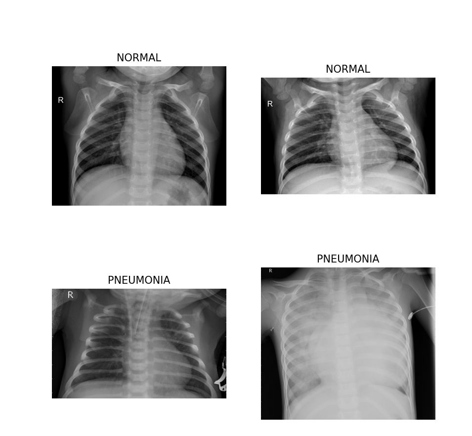

# 🫁 Chest X-Ray Disease Detection using Transfer Learning

This project focuses on detecting **Pneumonia** from **Chest X-ray images** using **Deep Learning** and **Transfer Learning**.  
A pretrained convolutional neural network (DenseNet121) is used as a feature extractor, with a custom classification head trained to distinguish between **NORMAL** and **PNEUMONIA** X-rays.

The goal of this project is to build a reliable and efficient medical image classification pipeline while addressing common challenges such as **imbalanced data**, **overfitting**, and **limited dataset size**.

---

## 📂 Dataset Structure

The dataset follows a standard directory structure compatible with TensorFlow pipelines:
archive/chest_xray/
├── train/
│ ├── NORMAL/
│ └── PNEUMONIA/
├── val/
│ ├── NORMAL/
│ └── PNEUMONIA/
└── test/
├── NORMAL/
└── PNEUMONIA/

- **Training set**: Used for learning model parameters  
- **Validation set**: Used for monitoring performance during training  
- **Test set**: Used for final evaluation  

The dataset is **imbalanced**, with more pneumonia cases than normal cases.

---

## 🖼 Sample X-ray Images

Below are example images from the dataset showing both classes:

> NORMAL X-rays show clear lung fields, while PNEUMONIA cases often exhibit opacity and consolidation patterns.

## 🔍 Project Workflow

### 1️⃣ Data Exploration
- Visualized sample chest X-ray images
- Analyzed class distribution and identified dataset imbalance

### 2️⃣ Data Preprocessing
- Resized all images to **224 × 224**
- Converted grayscale images to **RGB** to match pretrained model requirements
- Normalized pixel values to the range **[0, 1]**
- Built an efficient TensorFlow `tf.data` pipeline

### 3️⃣ Data Augmentation
Applied **data augmentation only on the training set** to reduce overfitting:
- Random rotation
- Random zoom
- Random translation
- Random contrast

This helps the model learn **general patterns** instead of memorizing pixel-level details.

### 4️⃣ Model Building (Transfer Learning)

- Used **DenseNet121** pretrained on ImageNet
- Removed the original classification layer (`include_top=False`)
- Froze pretrained layers to prevent overfitting
- Added a custom classification head:
  - Global Average Pooling
  - Batch Normalization
  - Dense layer
  - Dropout for regularization
  - Sigmoid output layer (binary classification)

### 5️⃣ Handling Class Imbalance
- Computed **class weights** based on training label distribution
- Applied `class_weight` during training so the model gives more importance to the minority class

### 6️⃣ Model Training
- Optimizer: Adam
- Loss function: Binary Cross-Entropy
- Metrics: Accuracy
- Model trained for multiple epochs with validation monitoring

### 7️⃣ Evaluation
- Evaluated model performance on the test set
- Metrics considered:
  - Accuracy
  - Precision
  - Recall
  - F1-score
  - Confusion Matrix
- Visualized training vs validation loss and accuracy curves

## 📁 Project Structure
CNN/
├── archive/
│ └── chest_xray/
├── explore_data.py # Data exploration and visualization
├── preprocess_data.py # Preprocessing and data pipeline
├── model.py # Transfer learning model definition
├── train.py # Training with class imbalance handling
├── evaluation.py # Model evaluation and metrics
├── chest_xray_densenet_model.h5
└── README.md

## 🛠 Technologies Used
- Python
- TensorFlow / Keras
- NumPy
- Matplotlib
- Transfer Learning (DenseNet121)